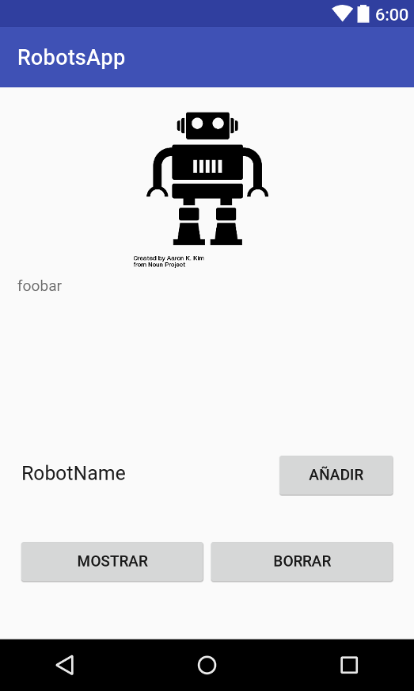

##RobotsApp
[toc]

### Estructura de datos

La libreria Collections de java implementa varias estructuras de datos  que nos permiten ahorrar tiempo y ganar en claridad. Esta aplicación usará la colección `ArrayList` que implementa la interfaz `List`. La elección de esta clase ha sido por motivos de claridad y no de optimización. La elcción más óptima habría sido tal vez alguna de la implementaciones de la interfaz `Qeue`.

Los métodos que se usarán serán :

- `List.Add(String)` : añadirá un nuevo robot a la lista
- `List.Remove(int)` : borará el elemento contenido en el indice dado.
- `List.size()`       : devolverá el numero de elementos de la lista.

### Estructura y layout

La aplicación contará de 2 actividades, una principal en la que se gestiona la lista y otra en la que se muestra con ayuda de una `ListView`.

La actividad principal lanza la actividad que muestra la lista de robots cuando se pulsa el botón `show`.

### Main Activity
Primero se ha empezado por implementar la actividad principal como es lógico. Para hacedr esto se ha partido de la plantilla "empty activity".
#### Layout
Lo primero que se ha hecho ha sido el "layout" que se ha realizado con ayuda del editor gráfico para establecer la jerarquía. Esta layout consta de :

- 3 botones : para añadir y borrar elementos de la lista y mostrar la lista.  
- 1 cuadro de entrada de texto para introducir el nombre del robot nuevo.
- 1 imagen.
- 1 Un cuadro de texto para mostrar el numero de robots actuales.

 
 
Android permite autodimensionar una de las dimensiones de las views mediante pesos (`android:layout_weight`). De esta manera android establece diemsniones relativas proporcionales al peso asignado a cada view.
Para hacer uso de esta funcionalidad hay que poner la dimensión de interés a "0dp" : o bien `android:layout_height="0dp"` o bien `android:layout_weight="10"`. Una cosa que hay que tener en cuenta es que si se usa esta caracteristica en una View no  se podrá poner a `"match_parent"` en las Views del mismo nivel jerárquico.

Para establecer los callback de los botones se ha usado la propiedad `android:onClick`. Las funciones de callback deben ser publicas y seguir el prototipo `public void botonClickedCalback(View v)`.

De esta manera el layout de la actividad principal queda de la siguiente manera.

~~~xml
<?xml version="1.0" encoding="utf-8"?>
<RelativeLayout xmlns:android="http://schemas.android.com/apk/res/android"
    xmlns:app="http://schemas.android.com/apk/res-auto"
    xmlns:tools="http://schemas.android.com/tools"
    android:id="@+id/activity_main"
    android:layout_width="match_parent"
    android:layout_height="match_parent"
    android:paddingBottom="@dimen/activity_vertical_margin"
    android:paddingLeft="@dimen/activity_horizontal_margin"
    android:paddingRight="@dimen/activity_horizontal_margin"
    android:paddingTop="@dimen/activity_vertical_margin"
    tools:context="com.example.abdel.robotsapp.MainActivity">

    <LinearLayout
        android:orientation="vertical"
        android:layout_width="match_parent"
        android:layout_height="match_parent"
        android:layout_alignParentStart="true"
        android:layout_alignParentTop="true">

        <ImageView
            android:layout_width="match_parent"
            android:layout_height="0dp"
            android:layout_weight="10"
            app:srcCompat="@drawable/robot_noun_166712_cc"
            android:layout_alignParentBottom="true"
            android:layout_alignParentStart="true"

            android:id="@+id/imageView" />

        <TextView
            android:text="foobar"
            android:layout_width="match_parent"
            android:layout_height="0dp"
            android:layout_weight="10"
            android:id="@+id/textView_visor"></TextView>

        <LinearLayout
            android:orientation="horizontal"
            android:layout_width="match_parent"
            android:layout_height="0dp"
            android:layout_weight="5"
            >

            <EditText
                android:layout_width="0dp"
                android:layout_height="wrap_content"
                android:inputType="textPersonName"
                android:text="RobotName"
                android:ems="10"
                android:id="@+id/editText_robotName"
                android:layout_weight="2" />

            <Button
                android:text="@string/button_add_label"
                android:layout_width="0dp"
                android:layout_height="wrap_content"
                android:id="@+id/buttonAdd"
                android:layout_weight="1"
                android:onClick="addRobot" />
        </LinearLayout>

        <LinearLayout
            android:orientation="horizontal"
            android:layout_width="match_parent"
            android:layout_height="0dp"
            android:layout_weight="5">

            <Button
                android:text="@string/button_show_label"
                android:layout_width="0dp"
                android:layout_height="wrap_content"
                android:id="@+id/button_show"
                android:layout_weight="1"
                android:onClick="showRobots" />

            <Button
                android:text="@string/button_remove_label"
                android:layout_width="0dp"
                android:layout_height="wrap_content"
                android:id="@+id/button_remove"
                android:layout_weight="1"
                android:onClick="removeRobot" />
        </LinearLayout>
    </LinearLayout>

</RelativeLayout>
~~~

#### Código

La activity MainActivity se implementa en la clase  `com.example.abdel.robotsapp.MainActivity`. 

Primero nos fijaremos en `onCreate` metodo que se ejecuta al crear la activity. En este método inicializamos las referencias a los widgets(aka Views) de la actividad.

Si no hay guardada una intancia anterior de la actividad inicializamos la lista de robots con una lista vacía y añadimos 3 robots de ejemplo. En caso contrario cargamos la lista guaradada en el "Bundle" que contiene el estado de la instancia anterior. Para poder hacer esto se ha tenido que implementar `onSaveInstanceState(Bundle outState)` para guardar la lista de robots cada vez que la activity se ponga en segundo plano.

~~~java
    protected void onCreate(Bundle savedInstanceState) {
        super.onCreate(savedInstanceState);
        setContentView(R.layout.activity_main);
        Log.d(ROBOTS_APP_TAG,"oncreate()");
        textView_visor= (TextView) findViewById(R.id.textView_visor);
        editText_robotName= (EditText) findViewById(R.id.editText_robotName);

        if(savedInstanceState==null)
        {
            // es la ptimera vez que se crea la activity
            // creamos la lista de robots, para ello usamos la clase ArrayList que implementa la interfaz
            // List a traves de un Array.
            robotList=new ArrayList<String>();
            // Añadimos 3 robots para probar que va bien
            robotList.add("Robot 1");
            robotList.add("Robot 2");
            robotList.add("Robot 3");
        }else{
            // la activity existía se quitó de primer plano y se ha vuelto a abrir
            //existe un estado anterior-> lo recuperamos
            Log.d(ROBOTS_APP_TAG,"Recuperando estado anterior");
            robotList=(ArrayList<String>)savedInstanceState.getSerializable(EXTRA_ROBOTS_LIST);
        }

        // Actualizamos el texto de la MainActivity
        textView_visor.setText(""+robotList.size());
    }

~~~

Para el manejo de la lista se usan los callbacks de los botones "Add" y "Remove" :

- El callback del botón add (`addRobot(View view)`) obtiene el texto introducido en el cuadro de entrada y lo añade a la lista. Y actualiza el texto que indica el numero de robots que hay en la lista.
 Al final de la ejecución crea y muestra un Toast indicando que la operación ha sido correcta.
 
~~~java
        // leemos el texto de la caja de texto y lo convertimos a string
        String robotName=editText_robotName.getText().toString();

        // añadimos el nuevo robot a la lista
        robotList.add(robotName);
        Log.d( ROBOTS_APP_TAG,"Añadiendo nuevo elemento:"+robotName+"...\n"+Arrays.toString(robotList.toArray()));
        // Actualizamos el texto de la MainActivity
        textView_visor.setText(""+robotList.size());

        Toast.makeText(this,R.string.robot_added_succesfully,Toast.LENGTH_SHORT).show();
~~~

- El callback del botón "remove" (`removeRobot`) borra el último elemnto de la lista y también muestra un texto informativo.
 
~~~java
public void removeRobot(View view)
{

    if(robotList.size()>0) {
        robotList.remove(robotList.size()-1);
        Log.d( ROBOTS_APP_TAG,"Borrado un elemento");
    }else{
        Log.d( ROBOTS_APP_TAG,"La lista está vacia");
        // Creamos un toast y lo mostramos
        Toast.makeText(this,R.string.list_is_empty,Toast.LENGTH_SHORT).show();
    }

    // Actualizamos el texto de la MainActivity
    textView_visor.setText(""+robotList.size());

}
~~~

Para mostrar la lista el callback del botón "show" ejecuta una nueva actividad la cual muestra la lista de robots que se le pasan mediante un parámetro extra de tipo `Serializable`. Las clases que implementan la interfaz `Serializable` se pueden serializar o lo que es lo mismo convertirse en una secuencia de bytes de facil manipulación y transrporte entre programas. La interfaz `Serializable` es de java , el entorno Android tiene una  interfaz adicional para el mismo fin la interfaz `Parcelable`.

~~~java
public  void showRobots(View view)
    {
        Log.d( ROBOTS_APP_TAG,"Mostrando lista de bots...\n"+Arrays.toString(robotList.toArray()));

        //lanzamos RobotsShowActivity

        Intent intent = new Intent(this, RobotsShowActivity.class);
        intent.putExtra(EXTRA_ROBOTS_LIST, (Serializable) robotList);
        startActivity(intent);

    }
~~~

Para ejecutar una nueva Activity primero hay que crear un `Intent` que contendrá la información de la clase a ejecutar y los parámetros "extra" que se le pasarán. En este caso se pasa un solo parámetro `robotList` para ello usamos el método `putExtraString id, Serializable extra);`. Hay que notar que este método esta sobrecargado de manera que el segundo argumento puede ser cualquiera de los tipos básicos , arrays de estos , o clases que implementen o bien la interfaz `Serializable` o bien la interfaz `Parcelable`.

### RobotShowActivity

Esta actividad consta de un widget de tipo `ListView` que permite mostrar listas de manera cómoda.

#### Layout 

El layout en este caso es más simple pues sólo contiene un elemento: la `ListView`:

~~~xml
<?xml version="1.0" encoding="utf-8"?>
<RelativeLayout xmlns:android="http://schemas.android.com/apk/res/android"
    xmlns:tools="http://schemas.android.com/tools"
    android:id="@+id/activity_robots_show"
    android:layout_width="match_parent"
    android:layout_height="match_parent"
    android:paddingBottom="@dimen/activity_vertical_margin"
    android:paddingLeft="@dimen/activity_horizontal_margin"
    android:paddingRight="@dimen/activity_horizontal_margin"
    android:paddingTop="@dimen/activity_vertical_margin"
    tools:context="com.example.abdel.robotsapp.RobotsShowActivity">

        <ListView
            android:layout_width="match_parent"
            android:layout_height="match_parent"
            android:layout_marginStart="0dp"
            android:layout_marginTop="0dp"
            android:id="@+id/robots_list_view"
            android:layout_alignParentTop="true"
            android:layout_alignParentStart="true" />
</RelativeLayout>
~~~

#### Código

El código en este caso es también bastante sencillo. Todo se hace en `onCreate` : 

- Primero, extraemos la lista del `intent` :
~~~java
        //obtenemos el Intent
        Intent intent = getIntent();

        //obtenemos la lista de robots
        robotList=(List<String>) intent.getSerializableExtra(MainActivity.EXTRA_ROBOTS_LIST);
~~~
- Luego, obtenemos una referncia al objecto de nuestra `ListView` y le aplicamos los datos de la lista de robots. Para ellos usamos un adaptador que proporciona el SDK para arrays de strings :

~~~java
        robotsListAdapter = new ArrayAdapter<String>(this, android.R.layout.simple_list_item_1,robotList);
        ListView listView = (ListView) findViewById(R.id.robots_list_view);
        listView.setAdapter(robotsListAdapter);
~~~

### Strings.xml y internacionalización
En está aplicación se ha usado el archivo strings.xml, este archivo se utiliza para almacenar todas las constantes de cadenas de caracteres que se necesitan en un programa. A estas constantes se puede acceder tanto desde archivos xml con la sintaxis `@string/string_id` o desde java mediante la sintaxis `R.string.string_id` que nos devuelve un identificador de la cadena.

Lo interesante de este archivo es que facilita enormemente la traducción de las interfaces graficas pues se puede tener varios archivos string.xml uno or cada  idioma a groso modo. El sistema seleccionará el que coresponda con el idioma del dispositivo que en caso de no existir selecciónará el por defecto.

En esta aplicación se han creado 2 : uno que se usa por defecto (`res/values/strings.xml`) y otro para dispositivos cuyo idioma sea el español(`res/values-es/strings.xml`). La discriminación se hace por la carpeta en la que se encuentra.

A continuación se muestra el archivo correspondiente a la lengua española y una captura de aplicación en español :

~~~xml
<?xml version="1.0" encoding="utf-8"?>
<resources>
    <string name="list_is_empty">La lista está vacía</string>
    <string name="button_add_label">Añadir</string>
    <string name="button_remove_label">Borrar</string>
    <string name="button_show_label">Mostrar</string>
    <string name="robot_added_succesfully">Robot añadido satisfactoriamente!!</string>
</resources>
~~~

 
### Logging

Se ha usado la utilidad de loging de Android ofrecida por la clase `Log`. 

